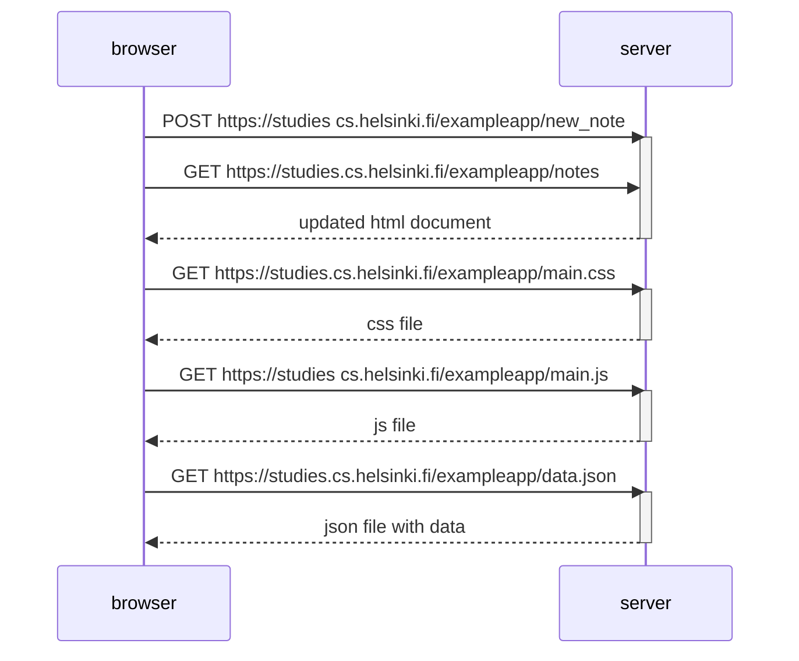

```mermaid
    sequenceDiagram
    participant browser
    participant server

    browser->>server: POST https://studies cs.helsinki.fi/exampleapp/new_note
    activate server

    browser->>server: GET https://studies.cs.helsinki.fi/exampleapp/notes
    server-->>browser: updated html document
    deactivate server

    browser->>server: GET https://studies.cs.helsinki.fi/exampleapp/main.css
    activate server
    server-->>browser: css file
    deactivate server

    browser->>server: GET https://studies cs.helsinki.fi/exampleapp/main.js
    activate server
    server-->>browser: js file
    deactivate server

    browser->>server: GET https://studies.cs.helsinki.fi/exampleapp/data.json
    activate server
    server-->>browser: json file with data
    deactivate server
```
